Neural Adaptive Sequential Monte Carlo Paper Implementation
===========================================================

This is an unaffiliated implementation of the following paper:

    Gu, S.S., Ghahramani, Z. and Turner, R.E., 2015. Neural adaptive sequential monte carlo. In Advances in neural information processing systems (pp. 2629-2637).

### Motivation

Monte Carlo inference is a general technique in which inference queries (among other quantities) 
on some probability distribution can be approximated primarily by taking an expectation of a function
using Monte Carlo integration. By maintaining a set of samples from some proposal distribution, 
this is then done simply by taking the mean of the function applied to those samples.
For example, given a set of `N` samples from some distribution `x ~ Q(X)`, one can approximate `Q(X > y)`
as:

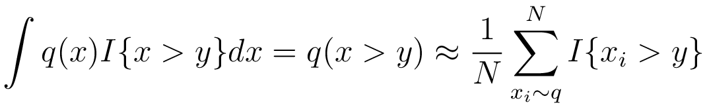

<!--
    \int q(x)  I\{x_i > y\} \approx \frac{1}{N} \sum_{x_i \sim q}^{N} I\{x_i > y\}
-->

Here the function being applied is simply an indicator function but it could be anything else. By choosing a
suitable function, many interesting quantities can be approximated. Often times, however, sampling
from a distribution is intractable due to its underlying formulation. Importance sampling is a related 
method that is used in these cases and allows one to separate the proposal distribution, which generates
the samples, from the target distribution, which is the distribution under which Monte Carlo integration is
being carried out. This is done with a relatively straightforward update to the original approximation:

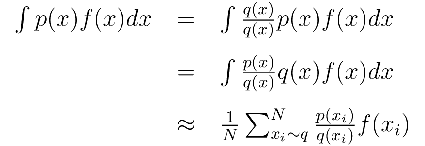

<!--
    \int p(x) f(x)dx = \int \frac{q(x)}{q(x)}p(x)f(x)dx = \int \frac{p(x)}{q(x)}q(x)f(x)dx \approx \frac{1}{N} \sum_{x_i \sim q}^{N} \frac{p(x_i)}{q(x_i)} f(x_i)
-->

There is also a variant in which only unnormalized probabilities are known which expands this method to
many real-world cases:

Taking <i>p(x) = p'(x) / Zp</i> and <i>q(x) = q'(x) / Zq</i>

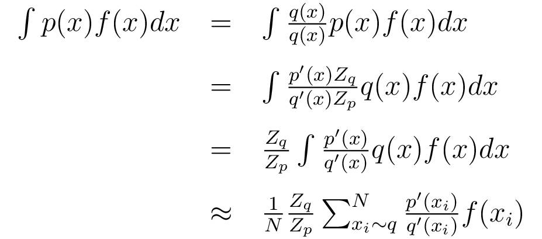

<!--

\int p(x) f(x)dx = \int \frac{q(x)}{q(x)}p(x)f(x)dx = \int \frac{p'(x) Z_q}{q'(x)Z_p}q(x)f(x)dx = \frac{Z_q}{Z_p} \int \frac{p'(x)}{q'(x)}q(x)f(x)dx \approx \frac{1}{N} \frac{Z_q}{Z_p} \sum_{x_i \sim q}^{N} \frac{p'(x_i)}{q'(x_i)} f(x_i)

-->

Note setting <i>f(x) = 1</i> yields:

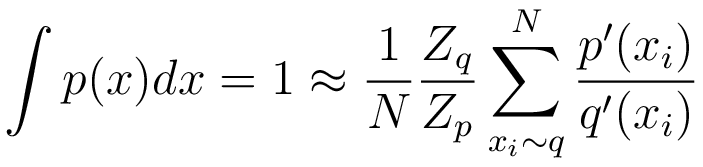

<!--

\int p(x)dx = 1 \approx \frac{1}{N} \frac{Z_q}{Z_p} \sum_{x_i \sim q}^{N} \frac{p'(x_i)}{q'(x_i)}

-->

resulting in:

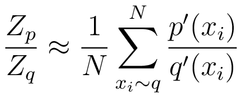

<!--

\frac{Z_p}{Z_q} \approx \frac{1}{N} \sum_{x_i \sim q}^{N} \frac{p'(x_i)}{q'(x_i)}

-->

The final approximation is therefore:

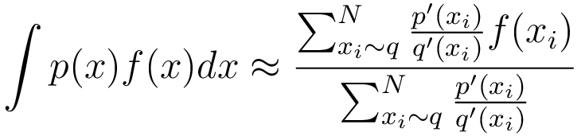

<!--

\int p(x)f(x)dx \approx \frac{\sum_{x_i \sim q}^{N} \frac{p'(x_i)}{q'(x_i)} f(x_i)}{\sum_{x_i \sim q}^{N} \frac{p'(x_i)}{q'(x_i)}} 

-->

In order for importance sampling methods to work well, the support of the proposal distribution should contain
the support of the target distribution. Ideally, the importance weights would also be close to one which
indicates that the two distributions are very similar. Having instead many samples with low importance weights
reduces the effectiveness of importance sampling because it means that these samples are not contributing
much to the Monte Carlo integral. This fact as it relates to Sequential Monte Carlo (SMC) filters is the 
main motivation behind the paper.

SMC filters leverage the same theory as importance sampling and are applied to problems typically involving
sequential state estimation. In this case, the target distribution changes from one timestep to the next and
is usually a posterior distribution of a state history conditioned on historical observations.

The paper introduced a novel technique for learning a proposal distribution that approximates the
true target distribution. As discussed, this mitigates issues related to a mismatched proposal distribution
and improves the sample efficiency of Monte Carlo methods.

### Key Contributions

* Proposed a gradient-based black-box adaptive SMC method that automatically tunes flexible proposal distributions using the inclusive KL-divergence between the target and proposal distributions.
* Significantly outperformed exiting adaptive proposal methods such as EKPF and UPF on standard benchmarks.
* Showed the method is applicable to higher-dimensional and more complex models.

### Approach

The problem setting involves a model consisting of states denoted by <i>zt</i> and observations 
<i>xt</i>. The posterior of the state at time step <i>t</i> is given by 
<i>p(z1:t | x1:t)</i>. Using the chain rule of probability, the joint distribution,
which is an unnormalized posterior, can be factorized as:

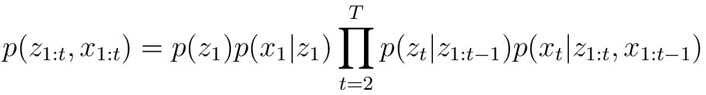

<!--

p(z_{1:t}, x_{1:t}) = p(z_1)p(x_1|z_1)\prod_{t=2}^{T}p(z_t|z_{1:t-1})p(x_t|z_{1:t},x_{1:t-1})

-->

The proposal distribution used in the paper follows a similar factorization:

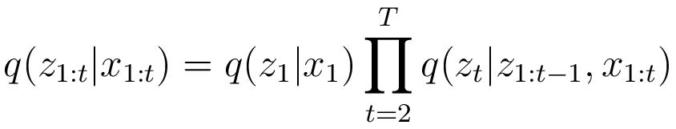

<!--

q(z_{1:t} | x_{1:t}) = q(z_1|x_1)\prod_{t=2}^{T}q(z_t|z_{1:t-1}, x_{1:t})

-->

At each time step, the proposal distribution is sampled from and the importance weights are computed for
each of these samples. After the first time step, however, this is preceeded by an initial resampling 
step that is used to ensure that existing samples remain effective.

The loss function is an approximation of the KL-divergence between the proposal and the target distributions.
Specifically, its derivative follows from the following steps:

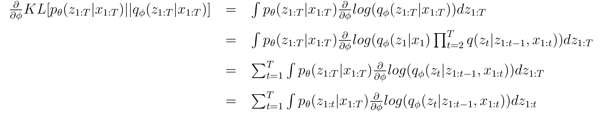

<!--

\frac{\partial}{\partial\phi} KL[p_\theta(z_{1:T}|x_{1:T})||q_\phi(z_{1:T}|x_{1:T})] = \int p_\theta(z_{1:T}|x_{1:T}) \frac{\partial}{\partial\phi}  log(q_\phi(z_{1:T}|x_{1:T})) dz_{1:T} = \int p_\theta(z_{1:T}|x_{1:T}) \frac{\partial}{\partial\phi}  log(q_\phi(z_1|x_1)\prod_{t=2}^{T}q(z_t|z_{1:t-1}, x_{1:t})) dz_{1:T} = \sum_{t=1}^{T} \int p_\theta(z_{1:T}|x_{1:T}) \frac{\partial}{\partial\phi}  log(q_\phi(z_t|z_{1:t-1}, x_{1:t})) dz_{1:T} = \sum_{t=1}^{T} \int p_\theta(z_{1:t}|x_{1:T}) \frac{\partial}{\partial\phi}  log(q_\phi(z_t|z_{1:t-1}, x_{1:t})) dz_{1:t}

-->

Where the last equation follows from marginalization of the unused integration variables.

The final step involves substituting the filtering distribution <i>p(z1:t | x1:t)</i> in for the smoothing distribution <i>p(z1:t | x1:T)</i>. Note that this adds bias to the
approximation since there is an error incurred, however, this approach allows the integral to be directly
approximated by using the intermediate importance weights of the SMC filter:

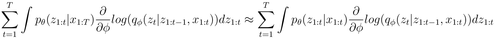

<!--

\sum_{t=1}^{T} \int p_\theta(z_{1:t}|x_{1:T}) \frac{\partial}{\partial\phi}  log(q_\phi(z_t|z_{1:t-1}, x_{1:t})) dz_{1:T} \approx \sum_{t=1}^{T} \int p_\theta(z_{1:t}|x_{1:t}) \frac{\partial}{\partial\phi}  log(q_\phi(z_t|z_{1:t-1}, x_{1:t})) dz_{1:T}

-->

In place of the integral, we can then instead use importance sampling resulting in the final expression:

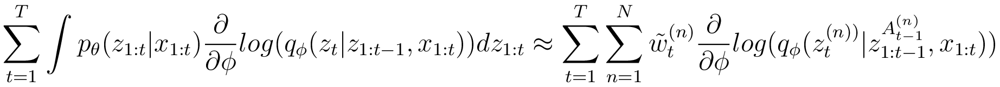

<!--

\sum_{t=1}^{T} \int p_\theta(z_{1:t}|x_{1:t}) \frac{\partial}{\partial\phi}  log(q_\phi(z_t|z_{1:t-1}, x_{1:t})) dz_{1:T} \approx \sum_{t=1}^{T} \sum_{n=1}^{N} \tilde{w}_t^{(n)}  \frac{\partial}{\partial\phi}  log(q_\phi(z_t^{(n))}|z_{1:t-1}^{A_{t-1}^{(n)}}, x_{1:t}))

-->

Note that the <i>w</i> are the importance weights for each of the <i>N</i> particles while 
<i>At(n)</i> is a set referencing the trajectory of particle <i>(n)</i> at time step 
<i>t</i>. Due to the resampling step this trajectory is updated and can be duplicated or removed over time.

Finally, a similar expression is also used to formulate the derivative of the maximum likelihood loss 
over the model <i>p</i>:

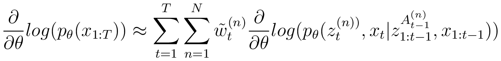

<!--

\frac{\partial}{\partial \theta} log(p_\theta(x_{1:T})) \approx \sum_{t=1}^{T} \sum_{n=1}^{N} \tilde{w}_t^{(n)}  \frac{\partial}{\partial\theta}  log(p_\theta(z_t^{(n))},x_t|z_{1:t-1}^{A_{t-1}^{(n)}}, x_{1:t-1}))

-->

### Implementation

This implementation follows the nonlinear state-space model experiment 
which is a simple 1-dimensional multi-modal model
with a cosinusoidal transition and observations that are quadratic in the state. 
An LSTM is used to parameterize a mixture-density network (3 diagonal Gaussians) 
similar to what is described in the paper. Some of the hyperparameters used were different (number of particles, batch size, etc.) but the
loss, optimizer, and learning rate (3e-3 using Adam) were the same.

Below is the convergence plot along with the final fit of the model:

    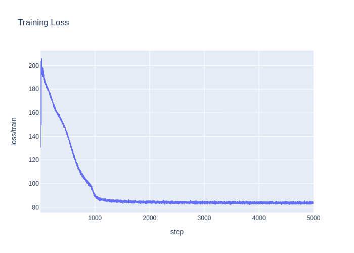

    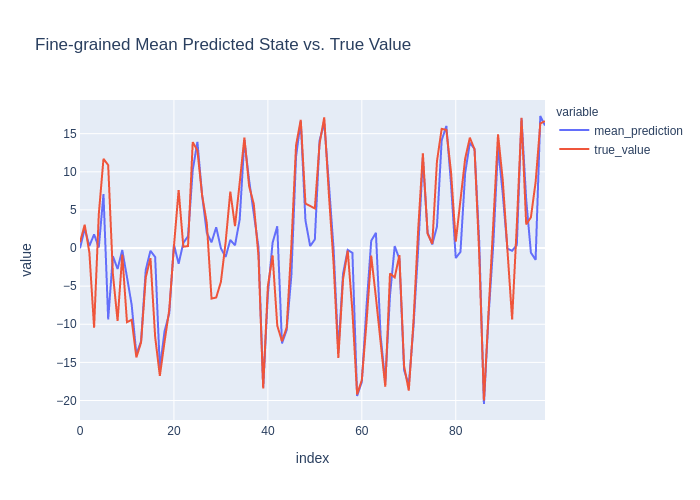

    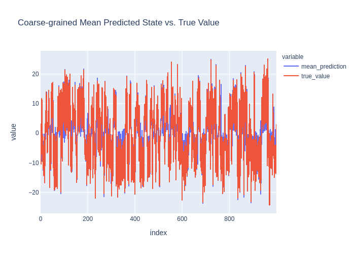

